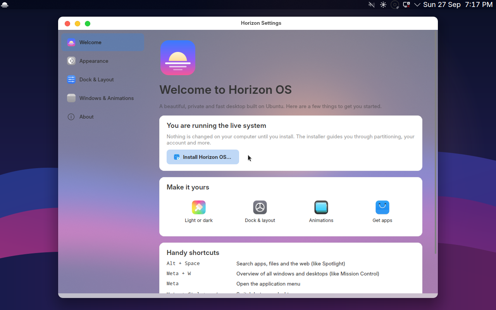

# Horizon OS

A macOS-style Linux distribution based on **Ubuntu 26.04 LTS** and **KDE Plasma 6**.



- **Menu bar on top.** Logo menu, a global application menu, system tray and clock.
- **Floating dock at the bottom.** Centered, with Launchpad (fullscreen app grid), pinned apps, running-app indicators and a Trash. It hides when a window touches it.
- **Spotlight-style search.** KRunner opens centered with `Alt+Space`.
- **Animations.** Genie minimise (Magic Lamp), scale open/close, window overview (`Meta+W`), blur and sliding desktops. There's one slider for animation speed.
- **macOS look.** WhiteSur theme for Plasma, window decorations, Kvantum app style, icons and cursors, plus the Inter font. The close/minimise/maximise buttons sit on the left.
- **Horizon Settings.** A friendly control panel for light/dark mode, accent colour, icons, wallpaper, dock position/size/visibility, three layout presets (macOS / Focus / Classic), title-bar button side, animation speed, minimise effect and toggles for blur and wobbly windows. Everything else is in KDE System Settings.
- **Graphical installer.** Calamares with its own branding and slideshow. It supports automatic or manual partitioning, ext4/btrfs/xfs, full-disk encryption, UEFI with **Secure Boot** and legacy BIOS, and it works offline.
- **Snap-free.** Firefox comes from Mozilla's official `.deb` repository. Discover installs apps from Ubuntu and Flathub.

## Building the ISO

You need an Ubuntu/Debian machine (a VM works) with about 25 GB free disk space and an internet connection.

```bash
git clone https://github.com/xaxel11/claude.git horizon-os
cd horizon-os
sudo ./build.sh            # ~30–60 min; result: build/horizon-1.0-amd64.iso
```

Or let GitHub build it: **Actions → Build ISO → Run workflow**. The ISO is attached to the run as an artifact. Pushing a tag such as `v1.0` also publishes a GitHub release.

### Stages

`build.sh` runs these steps in order. You can re-run any of them on its own, which helps when iterating:

| Stage | What it does |
|---|---|
| `deps` | Installs host tools (debootstrap, squashfs-tools, xorriso, …) |
| `bootstrap` | Creates a minimal Ubuntu system in `build/chroot` |
| `themes` | Downloads the WhiteSur KDE/icon/cursor themes |
| `debs` | Builds the `horizon-desktop` and `horizon-installer` packages |
| `chroot` | Installs Plasma, apps, themes and the Horizon packages into the image |
| `iso` | Compresses the image and builds a hybrid BIOS + UEFI (Secure Boot) ISO |
| `shell` | Opens a root shell inside the image so you can experiment |
| `clean` | Deletes `build/` |

For example, after changing only the dock layout:

```bash
sudo ./build.sh debs && sudo ./build.sh chroot && sudo ./build.sh iso
```

### Testing in a VM

```bash
qemu-system-x86_64 -enable-kvm -m 4G -smp 4 -cdrom build/horizon-1.0-amd64.iso                               # BIOS
qemu-system-x86_64 -enable-kvm -m 4G -smp 4 -bios /usr/share/ovmf/OVMF.fd -cdrom build/horizon-1.0-amd64.iso  # UEFI
```

VirtualBox and GNOME Boxes also work. Give the VM at least 4 GB of RAM and enable 3D acceleration so the animations run smoothly. To install onto real hardware, write the ISO to a USB stick with Ventoy, balenaEtcher or `dd`.

## Project layout

```
build.sh                        main build script (stages above)
config/
  distro.conf                   name, version, Ubuntu release, mirror, theme versions
  packages.list                 required packages
  packages-optional.list        installed if available
  packages-live.list            live-ISO only (installer)
  packages-remove.list          purged and blocked (snapd, …)
scripts/chroot-setup.sh         everything that runs inside the image
iso/grub.cfg                    live boot menu
assets/                         logo, Launchpad icon, light/dark wallpapers (SVG)
packages/
  horizon-desktop/              → horizon-desktop.deb
    etc/xdg/                    system-wide Plasma/KWin defaults (theme, fonts, animations)
    usr/share/horizon/layouts/  panel layouts: macos.js, focus.js, windows.js
    usr/share/plasma/look-and-feel/org.horizon.desktop/   applied on first login
    usr/bin/horizon-settings    the Horizon Settings app (Python + PyQt6)
    usr/lib/os-release          distro branding
  horizon-installer/            → horizon-installer.deb (live session only)
    etc/calamares/              installer modules, branding and slideshow
.github/workflows/build-iso.yml CI: lint, build the packages and the ISO
```

The customisation ships as real Debian packages, not files copied over the system. That means it survives upgrades, conflicts cleanly with Kubuntu's settings, and you can later publish updates through your own APT repository.

## Customising

| I want to… | Edit |
|---|---|
| Rename the distro | `DISTRO_NAME`, `DISTRO_ID`, `DISTRO_VERSION` in `config/distro.conf` |
| Add or remove apps | `config/packages*.list` |
| Change the dock apps, sizes or top bar | `packages/horizon-desktop/usr/share/horizon/layouts/macos.js` |
| Change default animations or window buttons | `packages/horizon-desktop/etc/xdg/kwinrc` and `kdeglobals` |
| Change theme, icons or fonts | `packages/horizon-desktop/etc/xdg/kdeglobals`, `plasmarc` and `kcminputrc` |
| Replace the logo or wallpaper | `assets/*.svg` (rendered to PNG during the build) |
| Change installer steps, partitioning or slides | `packages/horizon-installer/etc/calamares/` |
| Base it on a different Ubuntu release | `UBUNTU_SUITE` in `config/distro.conf`. Other releases may need package-name tweaks. |

Settings in `etc/xdg` are defaults, so each user can still override anything in System Settings or Horizon Settings.

To work on Horizon Settings without rebuilding the ISO, run it on any Plasma 6 desktop:

```bash
python3 packages/horizon-desktop/usr/bin/horizon-settings
```

## How the pieces fit

1. **Build:** debootstrap creates an Ubuntu base. Plasma and the apps are installed from the Ubuntu archive, the WhiteSur themes are installed system-wide, and the two Horizon packages are installed. The result is compressed to `casper/filesystem.squashfs`.
2. **Boot:** GRUB (signed shim for Secure Boot) loads the kernel. Casper creates the live user `horizon` and logs it into Plasma. On first login Plasma applies the `org.horizon.desktop` look-and-feel, which builds the menu bar and dock. The welcome screen opens with an **Install** button.
3. **Install:** Calamares partitions the disk and unpacks the squashfs. It installs the right GRUB for the machine (EFI or BIOS) from packages cached in the image, then creates your user and removes the installer and live-only packages.

## Legal notes

- Horizon OS is **not affiliated with Apple or Canonical**. Do not ship Apple logos, the "macOS" name as branding, or Apple fonts and wallpapers. The WhiteSur themes are GPL-licensed recreations and are fine to use.
- Canonical's trademark policy requires derivatives to use their own name and logo. This project does that: see `DISTRO_NAME` and `/usr/lib/os-release`.
- The artwork in `assets/` is original and may be used under CC-BY-SA-4.0.

## Roadmap ideas

- Custom Plymouth boot splash and SDDM login theme
- Your own APT repository for updates to `horizon-desktop`
- Optional dock magnification and a hot-corner editor in Horizon Settings
- ARM64 builds
